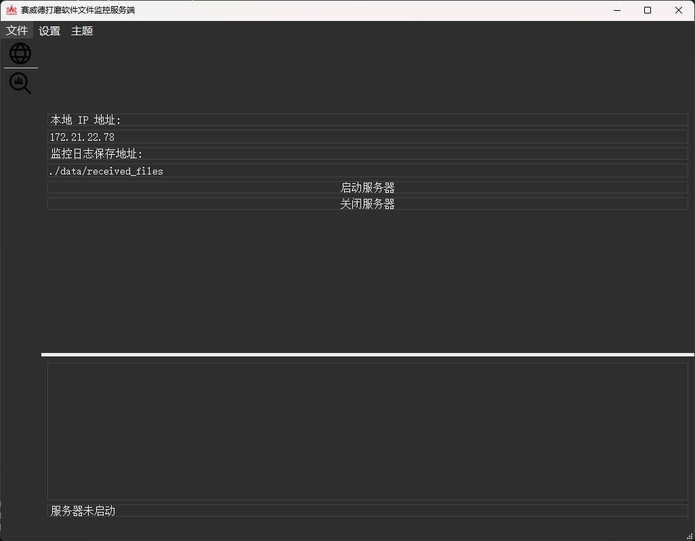

<div align=center>

</div>

---

# 文件监控服务端项目


## 简介

文件监控服务端是一个基于 Python 和 PyQt5 的桌面应用程序。该程序允许用户通过图形界面启动和关闭文件服务器，并实时监控赛威德视觉打磨软件记录的日志。基于streanlit对日志文件进行可视化。




## 功能

- 启动和关闭文件服务器。
- 上传服务端文件夹内没有的日志文件
- 实时显示连接的客户端及其发送的文件数量。
- 支持选择明亮或暗黑主题界面。
- 配置灵活，支持自定义服务器的 IP 地址和端口。
- 日志记录服务器活动。

## 项目结构

```
project_root/
│
├── server/
│   ├── __init__.py
│   ├── server_backend.py         # 服务器的核心功能，如启动和处理客户端请求
│   └── server_controller.py      # 控制服务器启动和停止的逻辑
│
├── ui/
│   ├── __init__.py
│   └── server_gui.py             # GUI 界面逻辑
│
├── config/
│   └── settings.py               # 配置文件，如端口、IP等设置
│
├── logs/
│   └── server.log                # 日志文件
│
├── utils/
│   ├── __init__.py
│   └── helpers.py                # 实用工具函数，如日志记录、文件操作等
│
├── data/
│   └── received_files/           # 存放接收到的文件
│
├── tests/
│   ├── __init__.py
│   └── test_server.py            # 服务器模块的测试脚本
│
└── main.py                       # 项目入口文件
```

## 安装

### 先决条件

- Python 3.6 或更高版本
- PyQt5 库

### 安装步骤

1. **克隆仓库**
   ```bash
   git clone 
   cd 
   ```

2. **安装依赖**
   使用 `pip` 安装所需的 Python 库：
   ```bash
   pip install -r requirements.txt
   ```

3. **运行应用程序**
   在项目根目录下执行以下命令启动 GUI 应用程序：
   ```bash
   python main.py
   ```

## 使用指南

1. **启动服务器**
   - 打开应用程序后，点击“启动服务器”按钮，服务器将开始监听指定的 IP 地址和端口。

2. **关闭服务器**
   - 要关闭服务器，请点击“关闭服务器”按钮。所有当前连接的客户端将断开连接。

3. **更改主题**
   - 使用菜单栏中的“选择主题”选项，可以在明亮主题和暗黑主题之间切换。

4. **查看日志**
   - 服务器的所有活动将记录在 `logs/server.log` 文件中。用户可以在该文件中查看详细的日志信息。

## 配置

可以通过编辑 `config/settings.py` 文件来更改服务器的默认配置，例如 IP 地址和端口号。

```python
DEFAULT_HOST = '0.0.0.0'
DEFAULT_PORT = 12345
```
